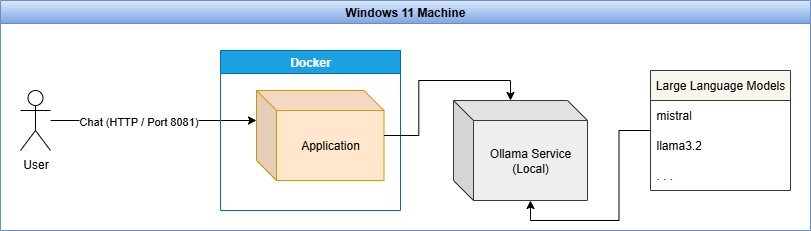

# Spring AI - Ollama Chat
The bare minimun needed to chat with your locally running Ollama AI models.

## Architecture
<p align="center">
  <a href="documents/architecture.png">
    
  </a>
</p>

## Pre-requisites:

- Java 21
- Docker
- Ollama

## Install ollama

Download and install Ollama
-  here: https://ollama.com/. 

This will allow you to run AI models locally on your computer. See documentation here:
- https://docs.ollama.com/

Pull a model by running the following command in your CMD prompt:
- ```ollama pull llama3.2```

_Note: This project uses llama3.2 by default but you can change to a model of your choice by updating application.properties. Ensure that you have pulled the model of your choice before attempting to run this Java project. You can also (optionally) pull and run models from Huggingface on Ollama: https://huggingface.co/docs/hub/en/ollama_

## Start infrastructure
```mvn package install```
or
```docker compose up --build```

## Destroy infrastructure
```mvn clean```
or
```docker compose down```

## Cleanup Docker (optional)
```docker system prune -f```
then
```docker network prune -f```
and finally
```docker volume prune -f```

## Developer details
- Brian Lukonsolo